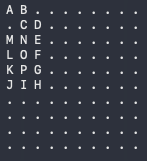
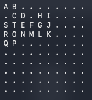
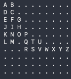

# Random-Walk
Solution to the Programming Project 9 of Chapter 8 from the book "C programming a modern approach", second edition by K. N. King

## Description
This is a solution to the project name above which states the following: 

"_Write a program that generates a “random walk" across a 10 x 10 array. The array will contain
characters (all ’ . ’ initially). The program must randomly “walk” from element to element;
always going up, down. left, or right by one element. The elements visited by the
program will be labeled with the letters A through Z, in the order visited._"

## Typical Output

